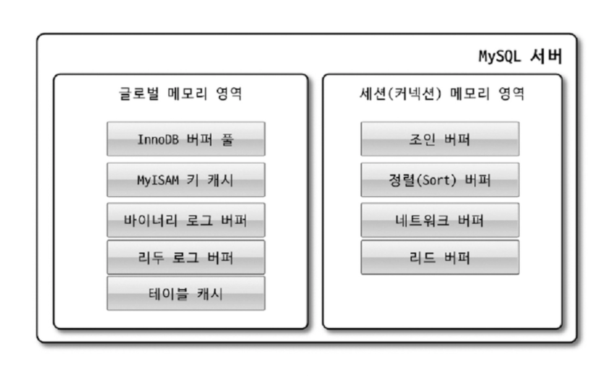
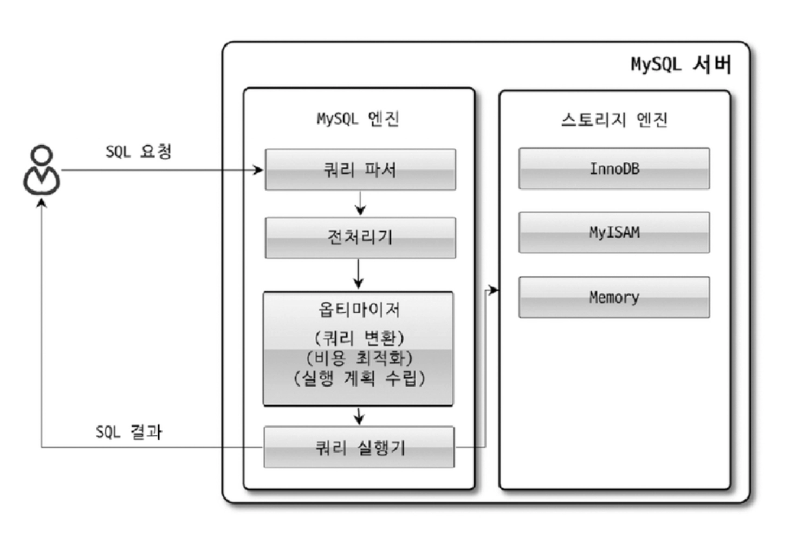
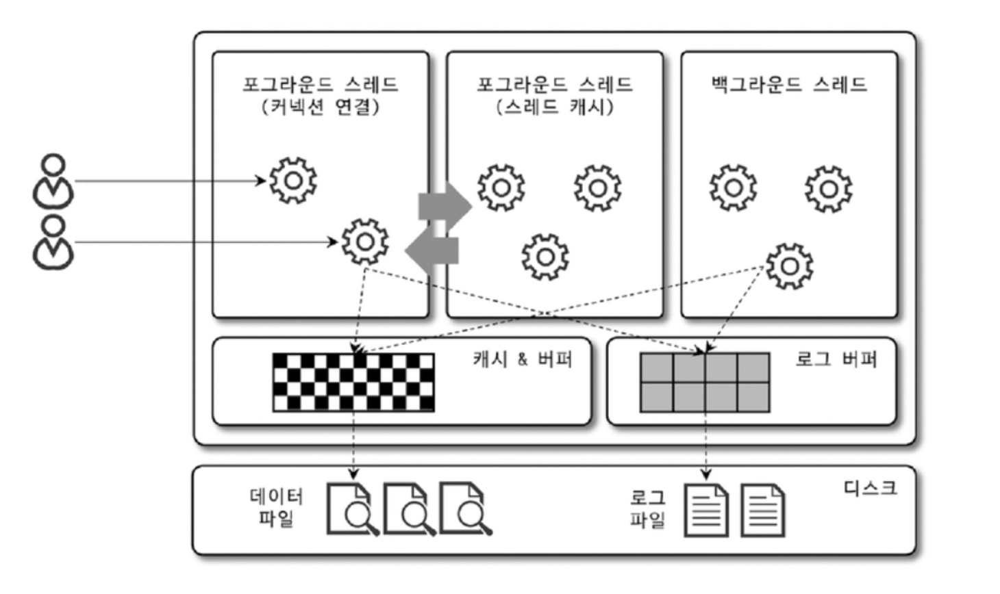

# MySQL 동작 원리

MySQL 은 크게 MySQL 엔진과 스토리지 엔진으로 나눌 수 있다

## MySQL 엔진

요청된 SQL 문장을 분석/최적화 하고 연결을 관리

- 커넥션 핸들러 : 클라이언트로부터 접속 및 쿼리 요청
- SQL 파서 및 전처리기
- 옵티마이저 : 쿼리의 최적화된 실행을 위한 최적화기

### 스토리지 엔진

실제 데이터를 스토리지에 저장하고 읽어옴

- MySQL 엔진은 하나지만, 스토리지 엔진은 필요에 따라 여러 가지를 바꿔 쓸 수 있음
- 각 스토리지 엔진은 성능 향상을 위해 키 캐시나 버퍼 풀 같은 기능을 내장
- MySQL 엔진의 쿼리 실행기에서 실 데이터를 읽어야 할 땐, 핸들러 API 를 이용해 스토리지 엔진에 실제 I/O 를 요청

### MySQL 메모리 구조

글로벌 메모리 영역: 테이블 캐시, InnoDB 버퍼 풀, InnoDB 어댑티브 해시 인덱스, InnoDB 리두 로그 버퍼

로컬 메모리 영역: 정렬 버퍼, 조인 버퍼, 바이너리 로그 캐시, 네트워크 버퍼

### 쿼리 실행 구조

쿼리가 실행되는 과정의 대부분의 작업이 MySQL 엔진에서 처리되며, 마지막 실데이터 읽기/쓰기 작업을 담당(SQL 파서 → 옵티마이저 → SQL 실행기 → 스토리지 엔진)

- 쿼리 파서가 쿼리 문장을 토큰화하여 트리 형태의 구조로 만들어냄.
- 전처리기는 파서 과정에서 만들어진 파서 트리를 기반으로 구조적인 문제가 있는지 확인
- 옵티마이저가 쿼리 문장을 저렴한 비용으로 가장 빠르게 처리할 수 있도록 결정
- 실행 엔진이 실제로 동작.
  - 실행 엔진은 옵티마이저가 결정한 사항을 핸들러에 요청 → 실제 핸들러가 작업을 수행.
  - 실행 엔진은 결과를 사용자/다른 모듈에 넘김
- 핸들러가 MySQL 서버의 가장 밑단에서 MySQL 실행 엔진의 요청에 따라 데이터를 디스크로 저장하고 읽어 오는 역할을 함.

### MySQL 쓰레딩

MySQL 서버는 프로세스 기반이 아닌 스레드 기반으로 동작하며, 포/백그라운드 스레드로 구분된다.

Foreground Thread

클라이언트 스레드의 최소 갯수는 MySQL 서버에 접속된 클라이언트의 수이며, 주로 쿼리 문장을 처리함

- 커넥션을 종료한다고 바로 스레드가 사라지는 것은 아니며, 스레드 캐시에 최근에 연결이 종료된 몇개의 스레드를 위치시킴
- 데이터를 버퍼나 캐시로부터 가져오고, 없다면 직접 디스크의 데이터나 인덱스 파일에서 읽어옴

Background Thread

- Log Thread, Write Thread 와 같이 버퍼의 데이터를 디스크에 쓰는 기능이 주요함
- 사용자의 요청을 처리할 때, 쓰기 작업은 지연 처리가 가능하나 읽기는 불가능함
- 즉 일반적으로 쓰기 연산은 버퍼링하여 일괄 처리

## MySQL 쓰레드 풀

### 1. 기본 방식의 문제점: "One-Thread-Per-Connection"

MySQL(Community 버전 기본 설정)은 클라이언트가 접속하면 무조건 스레드를 하나 할당

- CPU는 실제 쿼리를 처리하는 시간보다, 스레드를 교체하는(Context Switching) 시간에 더 많은 자원을 낭비하게 됨
- 결국 서버 성능이 급격히 저하되고, 심하면 멈춤

### 2. 해결책: 스레드 풀 (Thread Pool)

스레드 풀은 "동시에 실행되는 스레드의 개수를 CPU 코어 수에 맞게 제한"하는 모델.
핵심 원리: N:M 모델

- N (Connections): 수많은 클라이언트 연결 요청 (예: 10,000개)
- M (Active Threads): 실제로 CPU에서 실행되는 스레드 (예: 16~64개)

### 3. 스레드 풀의 상세 작동 메커니즘 (아키텍처)

MySQL 스레드 풀은 단순히 큐(Queue) 하나만 쓰는 것이 아니라, 효율을 위해 스레드 그룹(Thread Group)이라는 독특한 구조를 가짐

A. 스레드 그룹 (Thread Group)

- 전체 스레드 풀은 여러 개의 '스레드 그룹'으로 나뉩니다. (기본적으로 CPU 코어 수만큼 생성)
- 각 클라이언트의 연결(Connection)은 **Round-robin** 방식으로 특정 스레드 그룹에 배정됩니다.
- 이제 그 연결은 죽을 때까지 해당 그룹에서만 관리받습니다.

B. 큐 (Queue): High Priority vs Low Priority

스레드 그룹 내부에는 두 개의 큐가 존재하여 쿼리의 우선순위를 정함

- High Priority Queue (높은 우선순위): 이미 트랜잭션을 시작했거나, 락(Lock)을 점유하고 있는 작업. 빨리 끝내주지 않으면 다른 작업들까지 줄줄이 대기(Lock Wait)하게 만들어 새 작업보다 먼저 처리.
- Low Priority Queue (낮은 우선순위): 막 들어온 새로운 쿼리. High 큐가 비어 있어야 실행될 기회를 얻음

C. 타이머 스레드 (Timer Thread)와 스톨(Stall) 방지

만약 실행 중인 스레드가 디스크 I/O나 락 대기 등으로 인해 멈춰버리면(Stall) 어떻게 할까요?

- 스레드 풀에는 감시자(Timer Thread)가 있음.
- 특정 스레드가 오랫동안 응답이 없으면, 감시자가 이를 감지하고 "얘는 지금 멈췄으니, 새로운 스레드를 하나 더 투입해!"라고 명령하여 그룹 내 활성 스레드를 늘림. 이를 통해 CPU 가동률을 유지함.

## InnoDB 스토리지 엔진 아키텍처

InnoDB 는 레코드 기반의 잠금을 제공하기 때문에 높은 동시성 처리가 가능함

### Primary Key 에 의 한 클러스터링

InnoDB 의 모든 테이블은 기본적으로 프라이머리 키를 기준으로 클러스터링 되어있음

- 프라이머리 키를 기준으로 순서대로 디스크에 저장
- 모든 세컨더리 인덱스는 프라이머리 키의 값을 논리적인 주소로 사용
- 프라이머리 Key 를 이용한 Range Scae 은 빠르게 처리 될 수 있음

### 외래 키 지원

외래키에 대한 지원은 스토리지 엔진 레벨에서 진행됨

다만 외래 키는 부모 및 자식 테이블 모두 해당 칼럼에 인덱스 생성이 필요하고, 변경 과정에서 양쪽 모두 확인하는 과정을 거치기 때문에 여러 테이블에 Lock 이 전파될 위험이 있음

- 만약 시스템적으로 긴급 조치가 필요한 경우, foreign_key_checks 라는 시스템 변수로 off 가능
  - 부모 및 자식 테이블의 정합성 또한 수동으로 처리해야됨
  - ON DELETE CASCADE 또한 해제되기 때문에 주의 요망

### MVCC

데이터를 한 개만 유지하지 않고 여러 버전을 동시에 유지하는 동시성 제어 방식

MVCC 의 가장 큰 목적은 Lock 을 사용하지 않는 일관된 읽기를 제공하는 것인데, InnoDB 는 Undo Log 를 통해 이 기능을 구현함

락 기반방식:

- 어떤 트랜잭션이 row를 읽으면 공유락(S lock)
- 다른 트랜잭션이 그 row를 수정하려면 배타락(X lock) 필요
- 그래서 읽기 많은 시스템에서 쓰기가 막히고, 대기/데드락/지연이 늘어남

MVCC:

- 읽기는 락을 거의 안 잡고, 과거 버전을 읽음
- 쓰기는 새 버전을 만들고 커밋하면 그게 ‘현재’가 됨

in MySQL

- UPDATE/DELETE가 현재 페이지의 레코드를 바꾸는 형태
- 과거 버전은 undo 로그에 이전값으로 저장
- 트랜잭션이 스냅샷(READ VIEW)을 잡으면(읽을 때 필요하면) 언두 따라가며 옛 버전을 복원해서 읽음
- MVCC의 과거 버전은 undo 기반으로 재구성
- 특정 Tx에서 COMMIT/ROLLBACK 이 되지 않은 상태에서 다른 사용자가 조회를 하려고 한다면
  - 결과적으로는 Isolation Level 에 따라 다름
  - READ_UNCOMMITED 라면 InnoDB의 버퍼 풀이 갖고 있는 데이터를 반환함.
  - 이외의 경우엔 Undo 영역에 있는 값을 반환함.
- 트랜잭션이 길어지면 Undo 영역이 갖고 있는 데이터가 점점 길어지며 메모리 용량 문제가 발생할 수 있음.
- 참고로, COMMIT 이 된다고 Undo 영역의 데이터가 바로 삭제되는것은 아니고, 해당 영역이 필요한 트랜잭션이 더 없을 때 삭제 됨.

### MySQL의 자동 데드락 감지

- innoDB는 Lock 대기 목록을 Wait-For List로 관리함.
  - 데드락 감지 스레드가 주기적으로 이 그래프를 검사하고, Deadlock에 빠지게 되면 하나를 강제 종료함.
  - Undo 로그의 양이 적은 트랜잭션이 대부분 그 대상이 됨.
- 일반적으로는 성능적인 이슈가 발생하지 않으나, 동시 처리 스레드가 매우 많아지거나 각 트랜잭션이 가진 Lock의 개수가 많아지게 되면 데드락 감지 스레드의 속도가 느려짐.
  - 이런 상황에선, innodb_deadlock_detect 시스템 변수의 값을 OFF로 설정하여 해당 스레드를 꺼버릴 수 있다.
  - 다만 이 경우, 데드락이 발생하면 무한 대기에 놓이게 된다.
    - innodb_lock_wait_timeout 시스템 변수의 값을 수정하여 잠금을 획득하지 못한 트랜잭션을 일정 시간 후에 종료시키는 방법을 사용할 수 있다.
    - 기본값은 50초이지만, innodb_deadlock_detect를 끈다면 낮추는걸 권장함.
