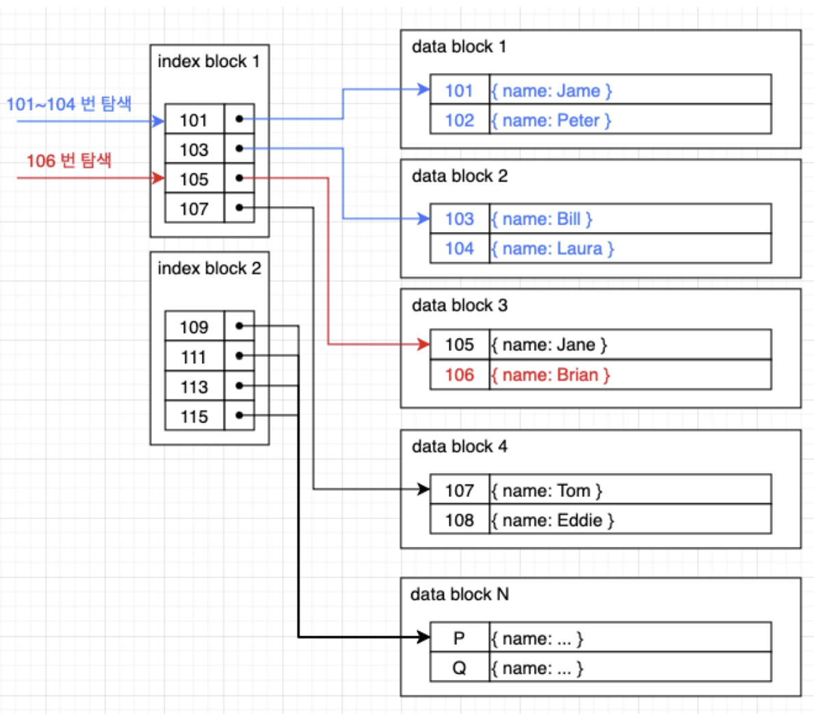
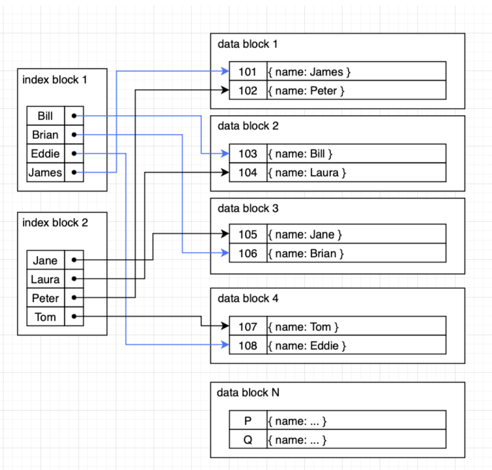
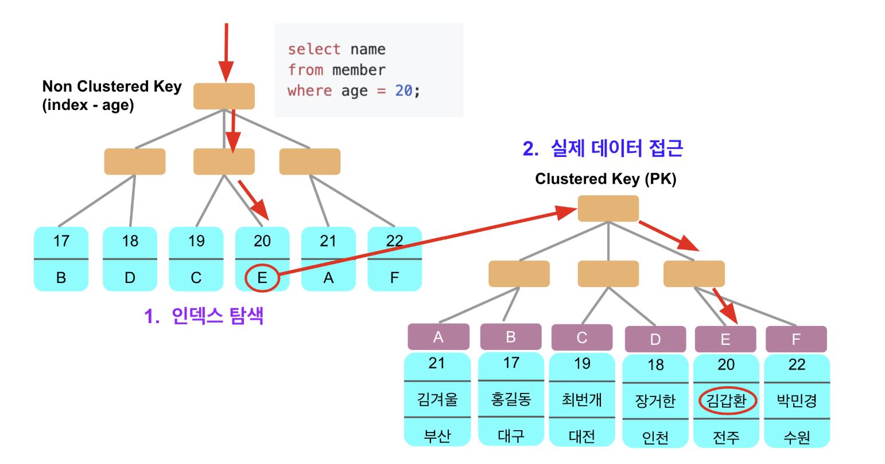

# DB:index

MySQL(InnoDB): 기본키 = 클러스터드 인덱스

- 테이블의 실제 row 데이터가 기본키 B+Tree 리프에 같이 저장됨.
- 세컨더리 인덱스 리프에는 (세컨더리 키 + PK)가 들어가서, 세컨더리로 찾은 뒤 PK로 한 번 더 타고 들어가는 구조가 기본. (PK가 곧 row 포인터 역할)

→  PK 설계가 모든 세컨더리 인덱스 크기/성능에 직결.

PostgreSQL: 힙 테이블 + 인덱스는 튜플 위치(TID)를 가리킴

- 인덱스는 보통 row가 저장된 위치를 가리키고, MVCC 때문에 보이는 버전인지 확인하려고 테이블을 추가로 방문.
- 조건이 맞으면 인덱스만 보는 index-only scan도 가능하지만, visibility map 상태에 따라 성능이 갈림.
- PG는 업데이트/삭제가 누적되면 dead tuple이 생기기 쉬워서 vaccum의 유지보수가 중요.

## B+Tree 구조

**특징**

- 모든 데이터는 Leaf Node에 저장
- Leaf Node는 Linked List로 연결
- 범위 검색에 최적화

**왜 Leaf에만 데이터 저장?**

- 트리 depth 최소화
- 검색 성능 향상

### Clustered Index vs Secondary Index

#### Clustered Index (PK)

- InnoDB 엔진에서 table의 Primary Key를 정의하면 Clustered Index
- 테이블당 하나만 가질 수 있다.
- Insert시 data가 정렬되고 index는 data block의 첫 번째 레코드의 주소값을 갖게 된다. index가 곧 바로 data block에 접근해서 Secondary Index보다 동작이 빠른 편
- data가 정렬되어 저장되므로, Secondary Index에 비해 범위로 질의를 하는 것에 유리하다. 빈번한 I/O가 덜 발생할 것이기 때문

#### Secondary Index

- Primary Key 이외에 필요한 정렬 기준이 있을 경우 사용한다.
- 테이블당 여러 개 가질 수 있다.
- data record가 정렬되어 있지 않다.
- index가 data record의 모든 주소값을 가지고 있어야 한다.
- unique 하지 않아도 된다.
- 데이터 레코드가 index 순서대로 정렬 되어 있지 않기 때문에 범위 조건으로 검색하게 되면 많은 I/O가 발생할 수 있다. 그러면 좋은 성능을 내지 못 할 것이다.
- index는 모든 레코드에 대한 색인 데이터를 들고 있어야 하고 정렬된다. 따라서, update, delete, insert시 오래 걸릴 수 있고, clustered index에 비해 더 많은 공간을 차지하게 된다.

## Questions

인덱스는 어떤 자료구조로 구현되나요?

- btree, b+tree,
- hash Index도 있지만, 동등 비교에는 빠른 반면 범위 검색이나 정렬에는 적합하지 않음

인덱스 스캔과 테이블 랜덤 I/O의 관계를 설명해보세요.

- 인덱스 스캔: 인덱스를 통해 필요한 데이터 위치를 빠르게 찾는 방식
- 인덱스에서 찾은 row -> 실제 테이블에서 데이터 페이지를 여기저기 접근하는 랜덤 I/O가 발생
- Secondary Index: 인덱스 탐색 후 PK를 통해 다시 Clustered Index를 조회해야 해 랜덤 I/O가 늘어날 수 있음

clustered Index , Secondary Index에 대해 설명

- Clustered Index는 실제 데이터가 인덱스 순서대로 저장되는 구조. InnoDB에서는 기본적 PK가 clustered index가 됨.
- PK 인덱스의 리프 노드에는 실제 row 데이터가 함께 저장
- Secondary Index: PK가 아닌 컬럼으로 인덱스. 리프 노드에는 인덱스 컬럼이랑, pk가 저장됨. -> Secondary Index 조회 후 PK를 이용해 Clustered Index를 한 번 더 조회.

자연키를 와 대체키 차이

- 자연키: 주민등록번호 학번처럼 비즈니스적으로 의미가 있는 값을 기본키로 사용하는 방식
- 대체키: id처럼 비즈니스 의미 없이 식별만을 위해 생성한 키

### B-tree, B+tree

B-tree, B+tree 에 대해 설명해보세요

- 정렬되 키 기반의 균형 트리 자료구조
- 노드 하나에 여러 키를 저장하고 -> 키 범위에 따라 자식노드로 이동
- btree: 내부노드와 외부 노드에 실제 데이터/데이터주소 저장
- b+tree: 실제 데이터는 외부노드에, 내부노드는 탐색을 위한 key만 가짐
  - 링크드리스로 연결되어 있음

Btree, B+tree의 차이와 뭐가 어떨때 좋은지 설명해보세요

- b-tree는 내부노드에도 데이터를 저장할 수 있어 특정 key를 내부에서 찾으면 탐색이 빨리 끝날 수 있음
- B+tree: 모든 데이터를 리프 노드에 저장하므로 항상 리프까지 내려 가야함. 다만 리프끼리 연결되어 있어서 범위 조회가 빠름
  - 내부 노드에 key만 저장하므로 한 노드에 더 많은 key를 담을 수 있어 트리 높이가 낮아짐 (한 노드는 한 페이지)
- 단건 조회: Btree | 범위검색/정렬/디스크IO 효율 다 고려하면 B+tree가 맞음

B+tree 기준 인덱스 탐색은 시간 복잡도로 보면 어떻게 설명할 수 있나요?

- O(logN) -> 한 노드가 여러 key를 가지므로 O(logₘN) 여기서 m은 한 노드가 가질 수 있는 자식 수

왜 대부분의 RDBMS는 B+Tree 계열 인덱스를 사용할까요?

- 범위 조회, 정렬, 그룹화, 조인 조건 탐색이 발생
- B+Tree는 키가 정렬되어 있고, 리프 노드가 연결되어 있어 `BETWEEN, <, >, ORDER BY` 같은 연산에 유리

C++/java 로 인덱스를 구현한다고 하면 어떻게 구현할 것인가

Hash Index와 B+Tree Index의 차이는 무엇인가요?

- Hash Index: key를 해시 함수에 넣어 위치를 찾음. 동등 조회가 빠름
- B+Tree : key가 정렬된 상태로 저장. 단건 조회는 물론 범위 조회와 정렬에도 활용 가능

### 복합인덱스

복합인덱스란?

- 다중 컬럼 인덱스, 컬럼 조합 기반 정렬 구조: (a, b, c)
- 단일 컬럼 인덱스 여러 개와 다른 구조

복합인덱스를 걸 때 컬럼 순서

- 조회 조건 빈도 -> 동등 조건 컬럼 우선
- 높은 선택도, 정렬 / 그룹핑 컬럼 고려
- 범위 조건 컬럼, 조인 조건 컬럼
- 쿼리 패턴

Cardinality가 인덱스 설계에 중요한 이유는 무엇인가요?

- 카니널리티가 높다 -> 중복이 적다
- 값의 고유성, 선택도
- 필터링 효율 -> 읽는 row 수 감소
- 옵티마이저 비용 판단, 인덱스 사용 여부 판단

Leftmost Prefix Rule이란 무엇인가요?

- 왼쪽 컬럼 우선 규칙
- (a, b, c) 인덱스
- abc 사용 가능, ab 사용 가능, bc 사용 불가

복합 인덱스에서 Range 조건이 나오면 조건 이후 컬럼은 왜 인덱스를 못 타나요?

- a -> b -> c 순서로 정렬됨.
- 중간에 범위 조건 나오면 뒤에있는거(c)는 정확한 탐색 조건으로 못씀. b범위 안에서 걸러내는 필터 조건임.
- DB에 따라 인덱스 내부에서 필터링으론 되는데 인덱스 탐색 범위 줄이는 데에는 못씀

Covering Index가 빠른 이유는 무엇인가요?

Boolean 컬럼에 인덱스를 걸면 효과가 있을까요?

- 어떤 경우엔 효과가 있을 수 있을까?

### 인덱스 판단 과정

문자열을 PK로 설정하면 어떤 문제가 있을 수 있나요?

Auto Increment PK와 UUID PK의 장단점은 무엇인가요?

인덱스를 탔는데도 느린 경우는 어떤 경우인가요?

인덱스는 항상 좋은가요? 많이 걸면 안되나요?

PK 크기가 Secondary Index 크기에 영향을 주는 이유는 무엇인가요?
