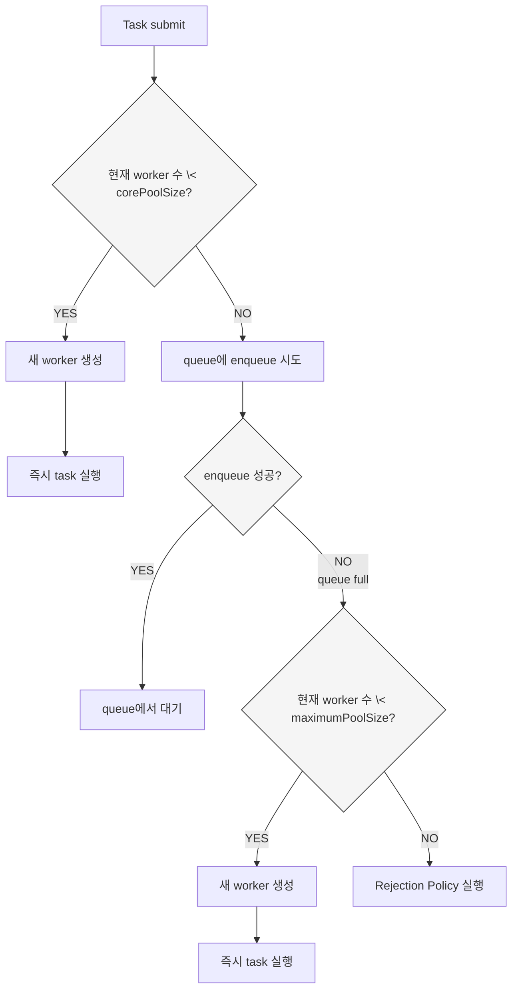

# ThreadPool 펑

서버 애플리케이션은 동시에 많은 요청을 처리해야 합니다.  
Java에서는 이러한 작업을 효율적으로 처리하기 위해 ThreadPool을 사용합니다.

ThreadPool은 미리 생성된 Worker Thread를 재사용하여 작업(Task)을 처리하여 다음과 같은 장점을 가져갑니다

- Thread 생성 비용 감소
- 동시 실행 가능한 Thread 수 제어
- 작업 대기 및 실행 관리
- 시스템 안정성 유지

하지만 ThreadPool 설정에 따라 과부하 상황에서 시스템의 동작이 크게 달라질 수 있습니다.
특히 다음 두 요소가 중요한 영향을 미친다고 합니다.

- Task Queue 정책
- Rejection 정책

잘못된 설정을 사용하면 시스템이 과부하 상황에서 요청을 계속 받아들이면서 latency가 폭발하는 문제가 발생할 수 있습니다.
_latency: 요청 하나의 처리 시간_

이 실험에서는 다음 요소를 비교하며 ThreadPool의 동작을 분석하고자 합니다.

- `LinkedBlockingQueue` vs `ArrayBlockingQueue`
- `AbortPolicy` vs `CallerRunsPolicy`
- `IO Bound` vs `CPU Bound`

---

## CS 복습하고 갑시다

### CPU 코어와 Thread

CPU는 동시에 코어 수만큼의 Thread만 실행할 수 있다.

```text
CPU Core = 8
Thread = 100
```

이 경우 실제로 동시에 실행되는 Thread는 8개뿐이며  
나머지는 OS 스케줄러에 의해 대기한다.

### Context Switching

CPU가 실행 중인 Thread를 교체할 때 발생하는 비용을 `Context Switching`이라고 한다.

Thread 전환 시 다음 상태를 저장하고 복원해야 한다.

- register
- program counter
- stack pointer
- thread state

Thread 수가 많아질수록 Context Switching 비용이 증가하여 전체 성능이 저하될 수 있다.

### CPU Bound vs IO Bound

작업의 특성에 따라 적절한 ThreadPool 전략이 달라진다.

#### IO Bound

대기 시간이 긴 작업
> wait time > compute time

- DB Query
- HTTP 요청
- File I/O

이 경우 Thread 수를 CPU 코어보다 많이 사용해도 성능 향상이 가능하다.

### CPU Bound

CPU 연산이 대부분인 작업
> wait time < compute time

- 암호화
- 이미지 처리
- 문자열 처리

이 경우 Thread 수는 CPU 코어 수에 가깝게 유지하는 것이 일반적으로 효율적이다.

### Queueing

ThreadPool 동작 구조

`Producer → Queue → Worker Thread → Task 처리`

여기서 중요한 값들

- λ (Arrival Rate) = 요청 도착 속도
- μ (Service Rate) = 작업 처리 속도

if(λ > μ) → Queue에 작업이 계속 쌓임

- Queue 길이 증가
- Latency 증가
- 메모리 사용량 증가

→ 시스템 포화(Saturation)

### Backpressure

시스템이 처리 가능한 속도를 초과하는 요청이 들어올 때 요청 유입 속도를 자연스럽게 제한하는 방법론

대표적인 방법

- Bounded Queue
- Rejection 정책
- Rate Limiting
- Circuit Breaker

## JAVA에서

### Executor Framework

Java는 Thread 관리 문제를 해결하기 위해 Executor Framework를 제공합니다.

Executor Framework의 기본 개념은 다음과 같습니다.

`Task 제출 → Executor가 실행 관리 → ThreadPool에서 실행`

개발자는 Thread를 직접 생성하는 대신 Task를 Executor에 제출하면 됩니다.

Executor Framework의 계층 구조는 다음과 같습니다.

`Executor ∋ ExecutorService ∋ ThreadPoolExecutor`

Executor

- 걍 기본적인 인터페이스

ExecutorService

- 작업 제출
- Future 결과 반환
- 작업 취소
- Executor 종료

ThreadPoolExecutor

- ExecutorService의 대표적인 구현체  
- Java ThreadPool의 핵심 동작을 담당

### ThreadPoolExecutor 동작 과정



### Queue 종류

ThreadPoolExecutor에서 사용할 수 있는 대표적인 Queue는 다음과 같습니다.

LinkedBlockingQueue

- 사실상 무한 큐
- reject 거의 발생하지 않음
- Queue가 계속 증가
- Latency 폭발

ArrayBlockingQueue

- 고정 크기 Queue
- Queue가 가득 차면 reject 발생
- Queue 크기 제한
- 시스템 과부하를 나타냄

### Rejection 정책

ThreadPool과 Queue가 모두 포화되면 Rejection 정책이 실행.

AbortPolicy

- 작업을 즉시 reject
- `RejectedExecutionException` 발생

CallerRunsPolicy

- reject 대신 submit한 쓰레드가 직접 작업 실행
- producer slowdown → 자연스러운 backpressure 형성

---

## Let's do that

쓰레드 풀 설정에 따른 시스템 동작 차이를 비교해보겠습니다.

비교 대상

- Queue: LinkedBlockingQueue vs ArrayBlockingQueue
- Rejection 정책: AbortPolicy vs CallerRunsPolicy
- 작업: IO Bound vs CPU Bound

> 2 Queue × 2 Policy × 2 Task = 8개 조합 실험

측정 지표

- avg latency
- p50 latency
- p95 latency
- p99 latency
- max latency
- accepted task count
- rejected task count
- max queue size
- total execution time

이번 실험에서 볼 포인트

- 무한 Queue가 latency에 미치는 영향
- Bounded Queue가 시스템 안정성에 미치는 영향
- CallerRunsPolicy가 실제로 Backpressure를 형성하는지
- CPU Bound 작업과 IO Bound 작업에서 적절한 ThreadPool 전략

### ThreadPoolExecutor

`ThreadPoolExecutor`의 Queue와 Rejection 정책, 작업 유형을 바꿔가며 동일한 부하를 주겠습니다.

```java
ThreadPoolExecutor executor = new ThreadPoolExecutor(
        CORE_POOL_SIZE,
        MAX_POOL_SIZE,
        0L,
        TimeUnit.MILLISECONDS,
        queue,
        threadFactory,
        rejectionPolicy
);
```

실험 설정 값들

```java
private static final int CORE_POOL_SIZE = 4;
private static final int MAX_POOL_SIZE = 4;
private static final int TOTAL_REQUESTS = 3_000;
private static final int SUBMIT_INTERVAL_MS = 10;
```

### IO Bound 흉내내기

```java
class IOBoundTask implements Runnable {
    @Override
    public void run() {
        try {
            Thread.sleep(200);
        } catch (InterruptedException e) {
            Thread.currentThread().interrupt();
        }
    }
}
```

### CPU Bound 흉내내기

```java
class CPUBoundTask implements Runnable {

    @Override
    public void run() {

        double value = 0;

        for (int i = 1; i < 15_000_000; i++) {
            value += Math.sqrt(i) * Math.sin(i);
        }

        if (value == Double.MIN_VALUE) {
            System.out.println("빼액");
        }
    }
}
```

### MeasuredTask

실행 시간과 latency를 포함하는 래퍼 클래스

```java
public class MeasuredTask implements Runnable{
    private final Runnable delegate;
    private final long submitTime;
    private final Metrics metrics;

    MeasuredTask(//....
    ) {
        // 생성자
    }

    @Override
    public void run() {
        try {
            delegate.run();
            long endTime = System.currentTimeMillis();
            long latency = endTime - submitTime;
            metrics.recordLatency(latency);
        } catch (Exception e) {
            metrics.incrementFailure();
        }
    }
}
```

이 방식으로 Queue / Rejection Policy / Task Type 조합을 변경하며 총 8개의 실험을 수행했습니다.

## 결과 요약

### IO Bound 결과

| Queue | Policy | Success | Reject | Avg Latency | p99 Latency | Max Queue |
|------|------|------|------|------|------|------|
| Linked | Abort | 3000 | 0 | 58s | 115s | 2288 |
| Linked | CallerRuns | 3000 | 0 | 58s | 115s | 2291 |
| Array | Abort | 812 | 2188 | 4.8s | 5.3s | 100 |
| Array | CallerRuns | 3000 | 0 | 4.3s | 5.3s | 100 |

---

### CPU Bound 결과

| Queue | Policy | Success | Reject | Avg Latency | p99 Latency | Max Queue |
|------|------|------|------|------|------|------|
| Linked | Abort | 3000 | 0 | 331s | 671s | 2812 |
| Linked | CallerRuns | 3000 | 0 | 348s | 688s | 2851 |
| Array | Abort | 252 | 2748 | 19s | 24s | 100 |
| Array | CallerRuns | 3000 | 0 | 23s | 30s | 100 |

---

## 자세히 보기

### LinkedBlockingQueue의 문제

LinkedBlockingQueue는 사실상 무한 Queue처럼 동작합니다.

`queue.offer()`가 항상 성공하고
→ reject 거의 없음
→ queue가 계속 증가합니다.

실험을 보면

IO Bound

```text
max queue size ≈ 2288
avg latency ≈ 58초
p99 latency ≈ 115초
```

CPU Bound

```text
avg latency ≈ 331초
p99 latency ≈ 671초
```

실제 작업 시간은 200ms 수준이지만 대부분의 시간이 Queue 대기 시간으로 소비됩니다.

즉 무한 Queue 전략은

```java
작업은 버리지 않지만
latency를 폭발시킵니다.
```

---

### ArrayBlockingQueue의 효과

ArrayBlockingQueue는 Queue 크기가 제한되어 있습디다.

```text
queue capacity = 100
```

따라서 Queue가 가득 차면

- AbortPolicy → reject 발생
- CallerRunsPolicy → producer가 직접 실행

실험을 보면

IO Bound

```text
avg latency ≈ 4.8초
p99 latency ≈ 5.3초
```

즉 Queue 크기가 latency 상한을 만들어줍니다.

---

### AbortPolicy

AbortPolicy는 시스템이 포화 상태가 되면 작업을 즉시 reject합니다.

- 빠른 실패로 시스템을 보호합니다.
- 요청이 손실되기는 합니다.

IO Bound

```text
success = 812
reject = 2188
```

CPU Bound

```text
success = 252
reject = 2748
```

---

### CallerRunsPolicy

CallerRunsPolicy는 reject 대신 submit한 thread가 작업을 직접 실행합니다.

이번 실험에서 가장 의미있는 발견이 submit 시간입니다

IO Bound

```text
submit duration
AbortPolicy      ≈ 36s
CallerRunsPolicy ≈ 125s
```

Producer가 작업 실행에 참여하면서 요청 투입 속도가 자연스럽게 감소했습니다.

즉 다음과 같은 Backpressure가 형성된다.

> producer slowdown → request rate 감소 → queue 안정

그래가지구..

- reject 없음
- latency 안정
- throughput 유지
  
---

## IO Bound vs CPU Bound 차이

### IO Bound

`wait time >> compute time`

- thread 수 증가 효과 존재
- queue 기반 처리 가능
- CallerRunsPolicy도 효과적

실험 결과 `ArrayBlockingQueue` + `CallerRunsPolicy` 조합이 가장 안정적이더라구요

---

### CPU Bound

`compute time >> wait time`

CPU가 이미 바쁜 상황에서 queue가 길어지면

- context switching 증가
- latency 폭발

`bounded queue` + 빠른 `AbortPolicy` 전략이 운영 안정적인 경우가 많습니다.

---

## 그래서

이번 실험을 통해 다음 사실을 확인하면 되겠습니다.

무한 Queue는 과부하를 숨긴다

- `LinkedBlockingQueue`는 작업을 버리지 않지만 queue가 폭발하면서 latency explosion를 발생시킴.

Bounded Queue는 latency 상한을 만든다

- `ArrayBlockingQueue`는 `queue capacity` 가 곧 `latency` 상한.

`CallerRunsPolicy`는 자연스러운 Backpressure를 만든다

- reject 대신 producer가 직접 작업 실행
- request rate 감소
- 시스템 안정

---

## 실무에서의 아키텍처 포인트

이번 실험은 단순히 Java `ThreadPool` 설정을 비교하는 것이지만, 실제로는 서비스 아키텍처 전체에서 발생하는 Queue 문제와 매우 유사한 구조를 보여줍니다.

많은 서버 시스템은 다음과 같은 구조를 갖습니다.

Client → API Server → ThreadPool Queue
 → Worker Thread → DB / External API

여기서 중요한 사실은 Queue는 항상 latency와 memory를 동시에 소비한다는 점입니다.

> queue length 증가 → latency 폭발 → memory 망~

즉 Queue가 커지면 시스템은 서서히 죽습니다.

### Backpressure는 필수

`Arrival rate (λ) > Service rate (μ)`

요청 속도가 처리 속도를 초과하는 상황은 드문 케이스가 아닙니다.

이때 시스템이 할 수 있는 전략은 크게 세 가지입니다.

- Queue에 계속 쌓는다  
- 요청을 거절한다  
- 요청 속도를 줄인다  

이 중 가장 안정적인 방식은 Backpressure라고 합니다.

이번 실험에서 `CallerRunsPolicy`는 다음과 같은 방식으로 Backpressure를 형성했습니다.

queue full → producer가 작업 실행 → request submit 속도 감소 → queue 안정

실제 서비스에서도 비슷한 전략을 사용합니다.

- **Rate Limiter**: 일정 시간 동안 처리할 수 있는 요청 수를 제한하는 방식
- **Circuit Breaker**: 외부 시스템이나 내부 서비스가 실패 상태일 때 장애 격리를 요청을 계속 보내지 않고 일시적으로 차단하는 방식
- **Load Shed**: 시스템이 과부하 상태일 때 일부 요청을 의도적으로 버리는 전략
- **Adaptive Concurrency Control**: 시스템 상태를 기반으로 동시 처리 요청 수를 동적으로 조절하는 방식

## 시스템 아키텍처에스의 Queue

ThreadPool Queue는 사실 아키텍처 레벨 Queue의 축소판이라고 볼 수 있습니다.

대규모 시스템에서는 다음과 같은 Queue들이 존재합니다.

- HTTP Request Queue
- ThreadPool Queue
- DB Connection Pool Queue
- Kafka와 같은 Message Queue
- Job Queue

이 모든 Queue는 동일한 특성을 가집니다.

queue 증가 → latency 증가 → memory 증가 → 시스템 포화

그래서 현대 서비스 아키텍처에서는 Queue를 무한하게 두지 않는 설계가 일반적입니다.

- bounded queue
- rate limit
- retry with backoff
- dead letter queue
- load shedding

### 대표적인 시스템 안정화 패턴

#### Bounded Queue

> Queue의 최대 크기를 제한하는 방식

Queue가 가득 차면

- 요청 reject
- backpressure 발생
- producer slowdown

효과

- latency 상한 설정
- 메모리 사용량 제한
- 시스템 포화 감지

ex

- ThreadPoolExecutor + ArrayBlockingQueue
- Kafka consumer buffer
- DB connection pool queue

#### Rate Limit

> 일정 시간 동안 처리할 수 있는 요청 수를 제한하는 방식

100 requests / second

요청 유입 속도를 제한하여 시스템 과부하를 방지한다.

대표 알고리즘

- Token Bucket
- Leaky Bucket

ex

- API Gateway
- 로그인 시도 제한
- 외부 API 호출 제한

---

#### Retry with Backoff

> 요청 실패 시 일정 시간 간격을 두고 재시도하는 방식

retry → delay → retry → delay

보통 Exponential Backoff를 사용 : `1s → 2s → 4s → 8s`

효과

- 장애 상황에서 트래픽 폭증 방지
- 외부 서비스 회복 시간 확보

ex

- HTTP client retry
- MQ consumer retry

---

#### Dead Letter Queue (DLQ)

> 처리에 실패한 메시지를 별도 Queue로 이동시키는 방식

message 실패 → retry 초과 → DLQ 이동

효과

- 실패 메시지 격리
- 시스템 정상 흐름 보호
- 장애 분석 가능

ex

- Kafka DLQ
- RabbitMQ DLX

#### Load Shedding

시스템 과부하 상황에서 일부 요청을 의도적으로 버리는 전략

queue full → low priority request drop

효과

- 핵심 서비스 보호
- latency 폭발 방지
- 시스템 전체 안정성 유지

ex

- Google SRE
- API Gateway
- CDN edge server
